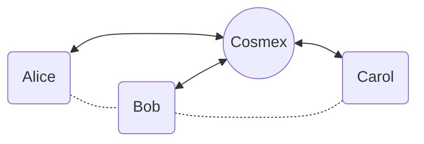

# COSMEX – Cardano Layer 2 Order Book Exchange

COSMEX is a Cardano layer-2 (L2) solution.
It extends Hydra Head protocol to provide a centralized order book exchange (CEX), but guarantees
the security of the funds and the privacy of the users.

Clients can deposit and withdraw funds to the exchange smart contract, and trade with other users
using off-chain orders. They always have the option to withdraw funds from the exchange smart
contract after a contestation period.

All the actual trades are guaranteed to follow client's orders, and are batched and settled on-chain
in an efficient way.

## The Problem

Current decentralized exchanges on Cardano face significant challenges:

- High latency and transaction costs due to on-chain execution
- Limited order book functionality
- Complex user experience requiring technical knowledge
- Front-running and MEV exploitation risks

## The Solution

COSMEX provides:

- Instant order execution with centralized order book matching
- Zero slippage and MEV protection
- Non-custodial security through smart contracts
- Simple user experience similar to traditional exchanges
- Full fund control with guaranteed withdrawal rights

## Technology

COSMEX uses a star-shaped network of state channels to enable off-chain trading:

1. Users deposit funds into smart contracts to open state channels
2. Trading occurs off-chain via centralized order matching
3. Users receive cryptographically signed state updates
4. Settlement batches are periodically committed on-chain
5. Users can unilaterally withdraw funds with latest signed state

Key advantages over existing solutions:

- More efficient than Hydra Head protocol for trading use case
- Lower fees and faster execution than AMM-based DEXes
- Better security guarantees than centralized exchanges

## How It Works

1. Alice deposits funds into a Cosmex smart contract to open a state channel.
1. Alice trades off-chain using Cosmex's API as if she were using a regular exchange. Cosmex
   provides Alice with a signed snapshot of her orders and balances.
1. When Alice is ready to close the channel and withdraw her funds, she can send a transaction with
   the latest signed snapshot on-chain to initiate the process. Cosmex may execute her open orders
   before timeout and then the remaining funds are guaranteed by the smart contract to be sent to
   Alice.
1. To keep the channels balanced, Cosmex periodically arranges on-chain transactions that transfer
   funds between parties. Think of it as a rebalancing mechanism using multi-party swaps.
1. If Alice doesn't cooperate or behave, Cosmex will close the channel and settle the balance
   on-chain. In any case, all her funds are guaranteed to be sent to her.

## Getting Started

### Prerequisites

Install Nix: https://nixos.org/nix/ with Flakes support.

Or make sure you have Java JDK 11, sbt, and Cardano Plutus uplc tool in your PATH.

### Working with Nix

Clone this repository and run `nix develop` to enter a shell with all the dependencies.
It may take a while to download all the dependencies the first time.

The shell will have Java JDK 11, sbt, uplc, cardano-node and cardano-cli available.

### Running tests

Run `sbt` to enter the SBT shell.

Then run `test` to run the tests.

Run `~testQuick` to run the tests automatically when a file changes.

Run `run` to run the main method, which will print the hex encoded double CBOR of Minting Policy script.