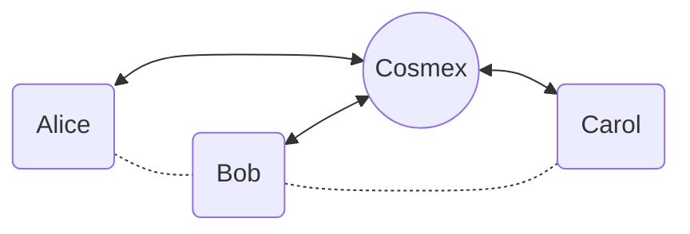
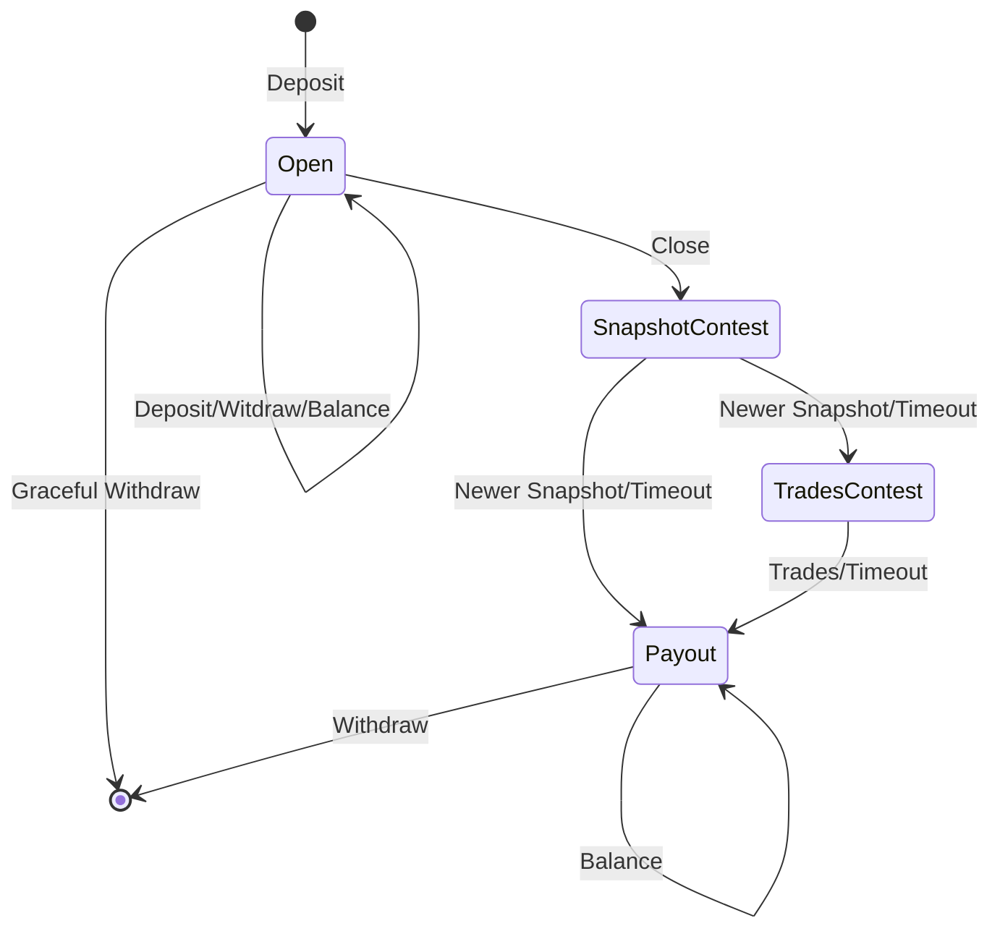

# COSMEX – Cardano Layer 2 Order Book Exchange

Litepaper v0.1

Alexander Nemish @ Lantr

## Abstract

COSMEX is a Cardano layer-2 (L2) solution.
It extends Hydra Head protocol to provide a centralized order book exchange (CEX), but guarantees the security of the funds and the privacy of the users.

Clients can deposit and withdraw funds to the exchange smart contract, and trade with other users using off-chain orders. They always has the option to withdraw funds from the exchange smart contract after a contestation period.

All the actual trades are guaranteed to follow client's orders, and are batched and settled on-chain in an efficient way.

## The Problem

Current decentralized exchanges on Cardano face significant challenges:

- High latency and transaction costs due to on-chain execution
- Limited order book functionality
- Complex user experience requiring technical knowledge
- Front-running and MEV exploitation risks

## The Solution

COSMEX provides:

- Instant order execution with centralized order book matching
- Zero slippage and MEV protection
- Non-custodial security through smart contracts
- Simple user experience similar to traditional exchanges
- Full fund control with guaranteed withdrawal rights

## Technology

COSMEX uses a star-shaped network of state channels to enable off-chain trading:

1. Users deposit funds into smart contracts to open state channels
2. Trading occurs off-chain via centralized order matching
3. Users receive cryptographically signed state updates
4. Settlement batches are periodically committed on-chain
5. Users can unilaterally withdraw funds with latest signed state

Key advantages over existing solutions:

- More efficient than Hydra Head protocol for trading use case
- Lower fees and faster execution than AMM-based DEXes
- Better security guarantees than centralized exchanges

## How It Works

1. Alice deposits funds into a Cosmex smart contract to open a state channel.
1. Alice trades off-chain using Cosmex's API as if she were using a regular exchange. Cosmex provides Alice with a signed snapshot of her orders and balances.
1. When Alice is ready to close the channel and withdraw her funds, she can send a transaction with the latest signed snapshot on-chain to initiate the process. Cosmex may execute her open orders before timeout and then the remaining funds are guaranteed by the smart contract to be sent to Alice.
1. To keep the channels balanced, Cosmex periodically arranges on-chain transactions that transfer funds between parties. Think of it as a rebalancing mechanism using multi-party swaps.
1. If Alice doesn't cooperate or behave, Cosmex will close the channel and settle the balance on-chain. In any case, all her funds are guaranteed to be sent to her.

Overall, Cosmex's channel system provides a secure and efficient way for traders to trade off-chain with the added benefit of reducing transaction fees and increasing transaction speeds.

It's faster and cheaper than on-chain trading, yet still secure and provably solvent.

No slippage, no front-running, no flash-loans, no IOUs. Your keys – your crypto.

## Technical Architecture

### State Channel Design

- Each user has a dedicated state channel with COSMEX
- State updates are cryptographically signed by both parties
- Smart contracts enforce state validity and fund security
- Contestation periods protect against malicious behavior

### Trading Flow

1. User deposits funds and receives channel state
2. Orders are matched off-chain with instant execution
3. Both parties sign state updates reflecting trades
4. Periodic on-chain settlement ensures chain consistency
5. Users can exit channel and withdraw funds at any time

## Competitive Advantages

Compared to existing solutions:

Vs Hydra:

- Simpler architecture optimized for trading
- No need for users to run nodes
- Better offline support

Vs AMMs/DEXs:

- Zero slippage
- Lower fees
- Instant execution
- True order book matching

Vs CEXs:

- Non-custodial
- No KYC required
- Smart contract security
- Guaranteed withdrawals

## Conclusion

COSMEX represents a major advancement in decentralized exchange technology on Cardano, combining the best aspects of centralized and decentralized trading while eliminating their respective drawbacks. Through innovative use of state channels and smart contracts, it delivers a superior trading experience without compromising on security or decentralization principles.

## References

Key technologies and concepts underlying COSMEX:

1. Cardano Blockchain Platform (IOHK, 2020)
Hydra: Fast Isomorphic State Channels (Chakravarty et al., 2020)
1. Bitcoin Lightning Network (Poon & Dryja, 2016)
1. SoK: Layer-Two Blockchain Protocols (Gudgeon et al., 2020)