# COSMEX – Cardano Layer 2 Order Book Exchange

## Abstract

COSMEX is a Cardano layer-2 (L2) solution.
It extends Hydra Head protocol to provide a centralized order book exchange (CEX), but guarantees the security of the funds and the privacy of the users.

Clients can deposit and withdraw funds to the exchange smart contract, and trade with other users using off-chain orders. They always has the option to withdraw funds from the exchange smart contract after a contestation period.

All the actual trades are guaranteed to follow client's orders, and are batched and settled on-chain in an efficient way.

## Desing overview

Clients connect to a centralized server, and use its REST/WS API to interact with the exchange. Most of the interactions are off-chain, where a client and the server exchange valid signed transaction, similarly to how Hydra Head or Bitcoin Lightning Network work.

### Deposit and withdraw

In order to trade a client must deposit funds to the Exchange Smart Contract (ESC) on-chain first.

To place or cancel orders, a client sends a signed transaction to the server that updates the state of the exchange smart contract with new list of orders.
The transaction is accepted and the client's order is added to the exchange order book (EOB).

When an order is matched, the client is notified and the server sends a signed transaction to the client that updates the state of the exchange smart contract with new list of orders. The exchange will update the state of the exchange smart contract with new list of orders off-chain. If needed the exchange will deposit/withdraw funds to/from the exchange smart contract on-chain to settle the trade.

A client can withdraw funds from the exchange smart contract by publishing its current state on-chain. This will put the ESC state machine into a contestation period. If there are matched trades on the exchange, the exchange will publish its current state on-chain. All funds that are not locked in orders will be withdrawn immediately.

## How does it work in a nutshell?

1. Alice deposits funds into a Cosmex smart contract to open a state channel.
1. Alice trades off-chain using Cosmex's API as if she were using a regular exchange. Cosmex provides Alice with a signed snapshot of her orders and balances.
1. When Alice is ready to close the channel and withdraw her funds, she can send a transaction with the latest signed snapshot on-chain to initiate the process. Cosmex may execute her open orders before timeout and then the remaining funds are guaranteed by the smart contract to be sent to Alice.
1. To keep the channels balanced, Cosmex periodically arranges on-chain transactions that transfer funds between parties. Think of it as a rebalancing mechanism using multi-party swaps.
1. If Alice doesn't cooperate or behave, Cosmex will close the channel and settle the balance on-chain. In any case, all her funds are guaranteed to be sent to her.

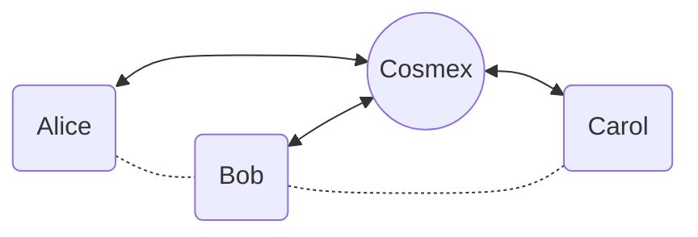

Overall, Cosmex's channel system provides a secure and efficient way for traders to trade off-chain with the added benefit of reducing transaction fees and increasing transaction speeds.

It's faster and cheaper than on-chain trading, yet still secure and provably solvent.

No slippage, no front-running, no flash-loans, no IOUs. Your keys – your crypto.

## Comparison with Existing Solutions

### Cardano Hydra

Cosmex is a specialized version of Hydra that uses a star-shaped network of state channels. There are a few differences:

- Cosmex uses a single state channel per pair of parties, while Hydra uses a single state channel for all parties.
- Cosmex allows users to join and leave the network at any time.
- Cosmex doesn't require a party to be always online unlike Hydra.
- Cosmex doesn't require a party to run a Cardano full node unlike Hydra.

### Uniswap / DEXes / AMMs

Cosmex is based on Cardano blockchain. It uses Plutus smart contracts to operate instead of Ethereum and EVM. This results in lower fees and faster transactions.

Uniswap is an automated market maker (AMM) that allows users to trade ERC20 tokens. Cosmex is a semi-centralized L2 order book exchange that allows users to trade Cardano native tokens.

### Centralized exchanges

Cosmex is a L2 order book exchange. It doesn't require KYC and doesn't hold user funds. It follows a decentralized protocol that uses Cardano smart contracts to operate and guarantees that all funds are always available to their owners. Cosmex mainly is a trading platform that allows users to trade Cardano native tokens.

## On-Chain State Machine

Every arrow is an on-chain transaction.

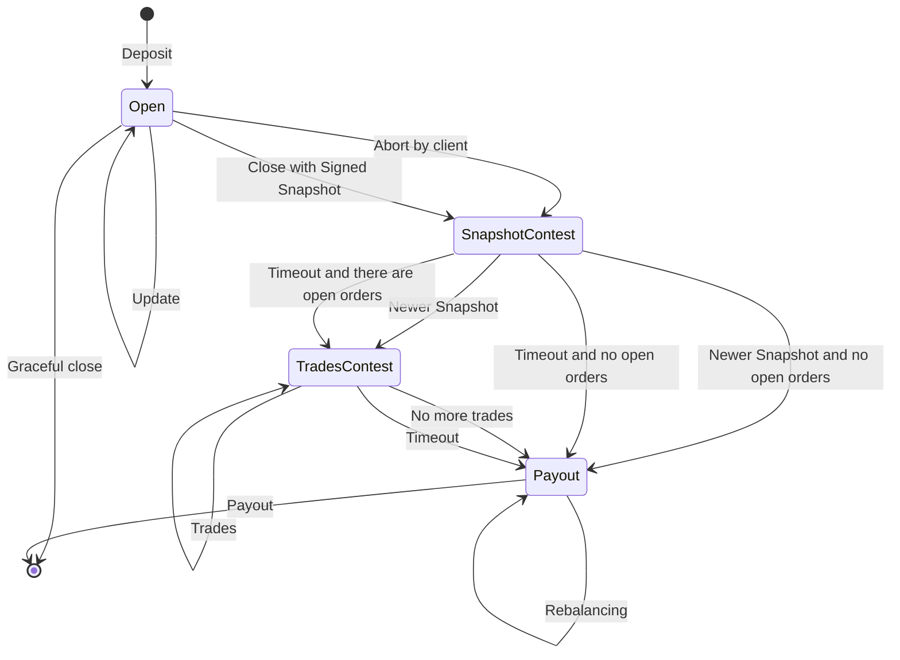

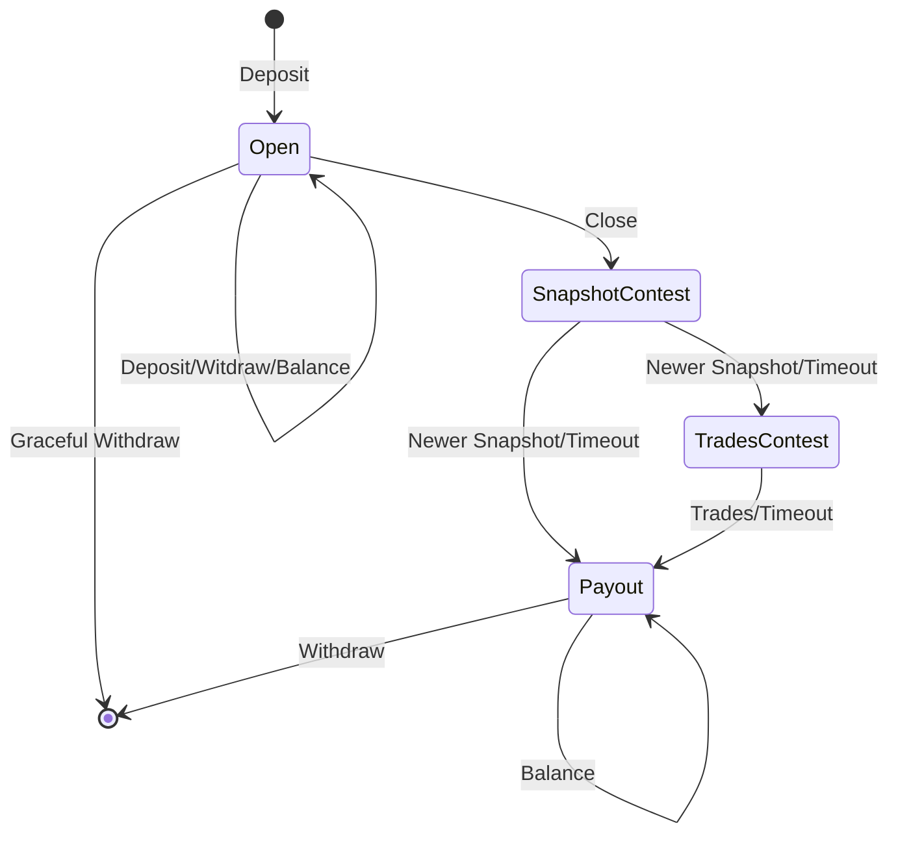

1. Commit money to Cosmex state channel by payinig to Cosmex script address and minting a NFT token that
ensures the validity of the Commit transaction.

## Open a channel

```scala
enum OnChainChannelState:
    case OpenState
    case SnapshotContestState(
        contestSnapshot: Snapshot,
        contestSnapshotStart: PosixTime,
        contestInitiator: Party,
        contestChannelTxOutRef: TxOutRef
    )
    case TradesContestState(
      latestTradingState: TradingState,
      tradeContestStart: PosixTime)
    case PayoutState(
      clientBalance: Value,
      exchangeBalance: Value)

case class OnChainState(
    clientPkh: PubKeyHash,
    clientPubKey: ByteString,
    clientTxOutRef: TxOutRef,
    channelState: OnChainChannelState
)
```

1. Alice sends to Cosmex a valid Tx with initial deposit, timeout 5 mins,
and a `ClientSignedSnapshot` v0.
Exchange can publish this Tx leaving Alice without BothSignedSnapshot for closure.
In that case Alice can publish a ClientAbort transaction and collect her initial deposit without a BothSignedSnapshot. See [Aborting the channel](#aborting-the-channel).
1. Cosmex replies with `BothSignedSnapshot` v0

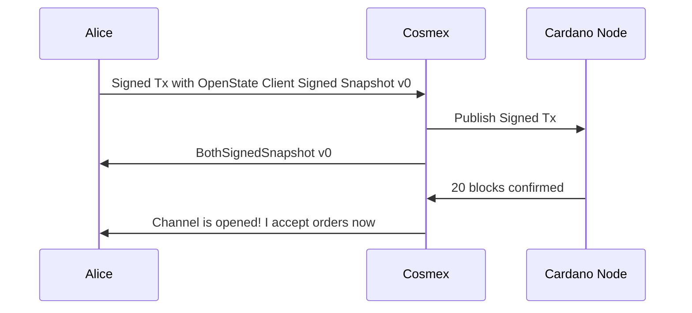

## Aborting the channel

Can only be initiated by a client. Doesn't need a BothSignedSnapshot.
Advances the State Machin to `SnapshotContestationState` with Snapshot v0,
and clientBalance = all the locked money.

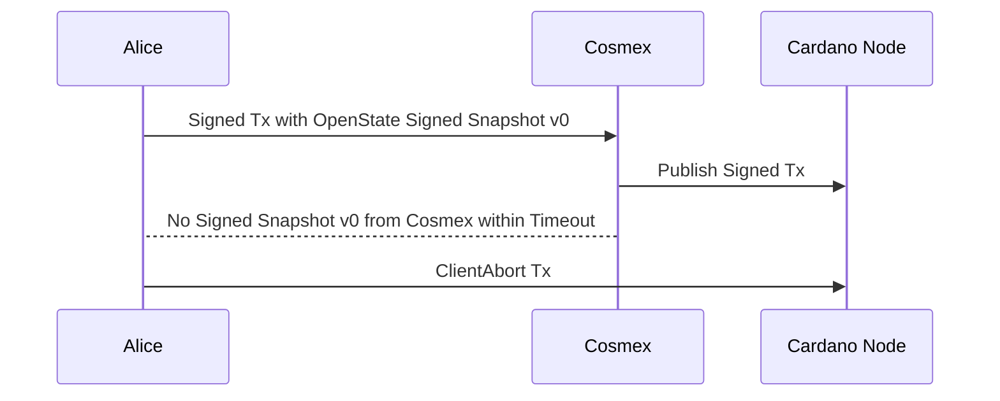

## Closing the channel

Either party can initiate a channel closure by starting the [Snapshot contestation](#snapshot-contestation).

## Snapshot contestation

If a party doesn't participate or behave, another party can always initiate
a snapshot contestation by closing the channel with `BothSignedSnapshot` it has.

A counterparty may contest the closing snapshot with a newer `BothSignedSnapshot`. Otherwise the initial closing snapshot is used, and the StateMachine can be advanced further by either party after the contestation timeout.

If the final snapshot contains open orders, then the StateMachine advances into `TradesContestation` state to allow the exchange to apply possible trades that happened since the latest snapshot.

If no open orders left, the machine goes to `PayoutState`

## Trades contestation

If the final snapshot contains open orders, some trades may have happened
since the channel closure started.
During the `TradesContestation` period, limited by a timeout, the exchange
may produce one or many transactions that apply trades to open orders.
Multiple transactions allowed to handle the case when not all trades can be fit into a single transaction.

After the timeout, anyone can be advance the StateMachine to `PayoutState`.

## Payout state

During this phase the channel may have non-zero exchange balance.
This means that the channel output locks either not enough funds or someone else's funds.

Anyone is allowed to produce transactions that transfer funds between
channels that balance them out.

A client can produce a transaction that withdraws available funds in client's balance.

## Off-chain trading

All trading operations are done via a WebSocket.

### Reopen a connection

Snapshot version synchronization. Restarts on timeout or on error.

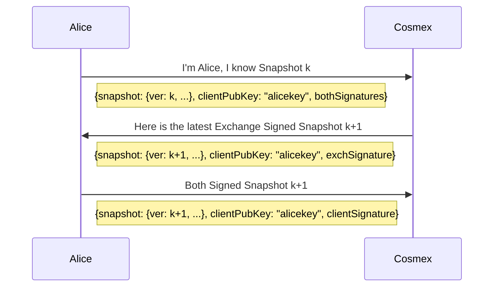

If Alice doesn't respond with it's signature Cosmex closes the channel with BothSignedSnapshot k, and disputes occured trades during `Trades Contestation` period.

### Open/close orders

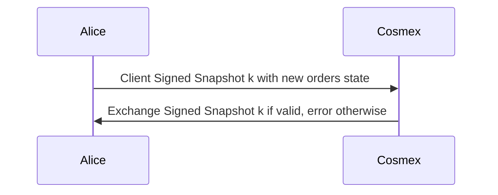

Cosmex may close the channel if the error rate is over a threshold.

### Trades

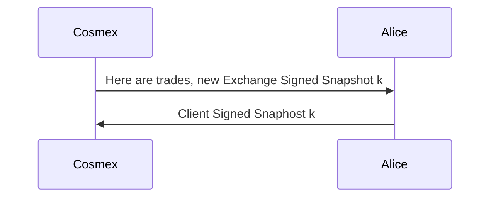

Cosmex closes the channel and starts the trades contestation
if Alice doesn't reply with a valid Client Signed Snapshot for some time and/or value at risk.

## Channel Update

Channel update is either:

- client deposit
- client withdraw
- graceful close
- rebalancing

There are some issues to consider:

- an update must be signed by both parties. What happens when counterparty doesn't cooperate? Must it be signed by both?
- We want to keep trading during the updates. Hence we need to progress snashots.
- How do we handle closure?
- How do we handle a counterparty that doesn't cooperate?

Idea 1. Let's say it's a deposit

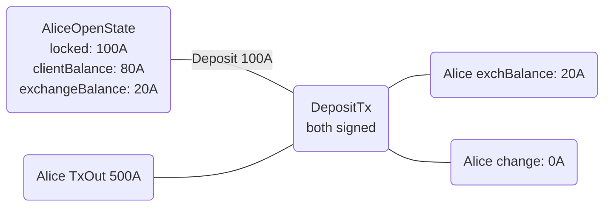

### PendingTx

The idea is to use a `PendingTx` to store info about the unconfirmed update in a Snapshot. One the exchange considers the update Tx confirmed, it sends a new Snapshot with the update applied.
If the update is reorged we can discard it in off-chain Snapshots.
The contestation logic checks if the PendingTx TxOut is spent, and accepts or discards the PendingTx. Hence, a party won't be able to close the channel with a PendingTx that is reorganised, timeouted or didn't happen.

```scala
enum PendingTxType:
    case PendingIn
    case PendingOut(txOutIndex: TxOutIndex)
    case PendingTransfer(txOutIndex: TxOutIndex)

case class PendingTx(
    pendingTxValue: Value,
    pendingTxType: PendingTxType,
    pendingTxSpentTxOutRef: TxOutRef
)
```

Happy path:

1. Deposit/Withdraw/GracefulClose is initiated by a client.
1. PendingTransfer is initiated by the exchange.
1. Update initiator sends an unsigned UpdateTx that outputs `updatedChannelTxOutRef` and a Signed Snapshot with `PendingTx{pendingTxSpentTxOutRef=updatedChannelTxOutRef}`.
The Tx must not be signed, otherwise it can be published on-chain by a counterparty while the initiator doesn't have the BothSignedSnapshot. The counterparty then can close the channel with the previous BothSignedSnapshot that doesn't have the PendingTx. This would mess up the correspondence between locked funds and Snapshot balances, making the channel unbalanced.
Consider the following scenario:
     - Alice balances: locked: 100A, clientBalance: 80A, exchangeBalance: 20A
     - Alice initiates a deposit of 100A by sending a Signed Snapshot with PendingTx{pendingTxSpentTxOutRef=channelTxOutRef} and _signed_ Tx that spends channelTxOutRef.
     - Cosmex signs the Tx and publishes it.
     - Cosmex closes the channel with the initial BothSignedSnapshot that doesn't have the PendingTx, making it unbalanced: locked: 200A, clientBalance: 80A, exchangeBalance: 20A.
     - Alice can't contest the channel closure because she doesn't have the newer BothSignedSnapshot with the PendingTx.
     - After timeout Cosmex can advance the StateMachine to PayoutState.
     - The money are stuck in the channel.
     - TODO: think about how to handle unbalanced channels. Avoid?
     - Possible solution: validate Close Snapshot balance == locked, reject otherwise.

1. Counterparty signs the Snapshot and Tx, sends it back. Now both parties have a BothSignedSnapshot.
1. The initiator signes the Tx and publishes it. If the Tx is reorged, the initiator sends a new BothSignedSnapshot with the PendingTx discarded.
1. After the Tx is confirmed, the exchange sends a new ExchangeSignedSnapshot with PendingTx accepted.
1. A client signs the Snapshot and sends it back.

### The contestation logic for PendingTx

On initial Close Snapshot store spending TxOutRef in contestation state.

On Snapshot contestation:
  if pendingTx exists:
    if pendingTxSpentTxOutRef is spent:
      accept the Snapshot and merge it with TradingState
    else:
      decline the PendingTx

### Graceful close

Designed to skip the contestation phases and close the channel in a single transation.

Prerequisites:

- synced BothSignedSnapshot
- limited Tx lifespan (1-5 mins) during which the exchange won't allow any client's actions to avoid concurrent updates
- no pending Tx
- clientBalance == locked, exchangeBalance = 0, no open orders
- both parties must sign Tx, otherwise a party can skip the contestation phase

Exchange signs to confirm the state, and its awareness of the client's intention to close the channel.

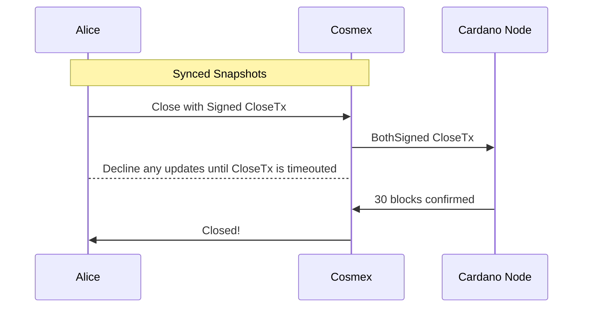

If the CloseTx is reorganised or timeouted, the channel is not closed.
The channel considered closed after 30 blocks.

### Deposit

1. Alice creates `DepositTx` that updates the channel:
valid for 5 mins, Datum: curSnapshot (hash?)
It's continuation TxOutRef is `pendingTxOutRef`

1. Alice sends Signed Snapshot with `pendingTxOutRef`.
Exchange can't use this pending money, because must spend `pendingTxOutRef` for that. Only by Closing, which spends it.
If the `DepositTx` is timeouts or is reorganised it's fine, the `pendingTxOutRef`
can't be spent and Closing logic will discard the pendingTx.

1. Cosmex replies with Signed Snapshot
It's safe for Cosmex because if it blocks other updates until `DepositTx` timeouts.
Alice can try to close the channel with the Snapshot but pendingTx will be discarded.

1. Alice sends signed DepositTx to Cosmex.
1. Cosmex signs and publish DepositTx.
1. After N confirmations Cosmex issues a new Snapshot with accepted pendingTx.
Otherwise Alice can Close the channel

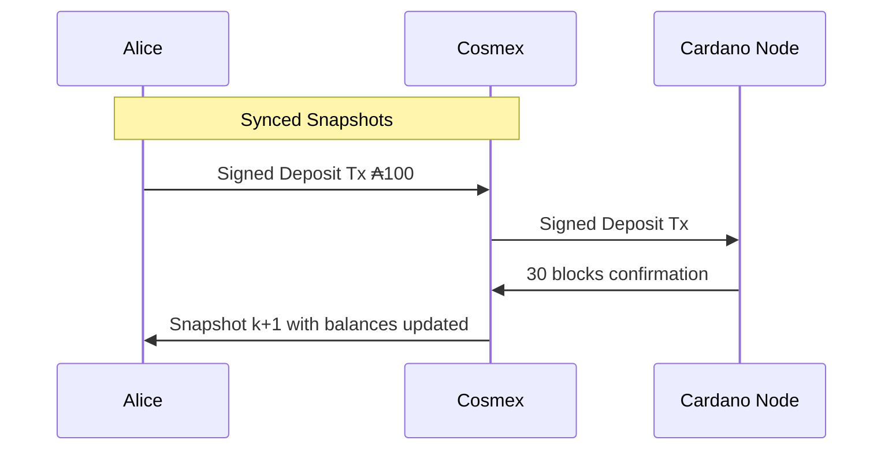

### Rebalance by Cosmex

In a simple form it's a two or more party swap initiated by the exchange.

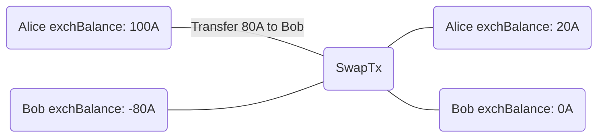

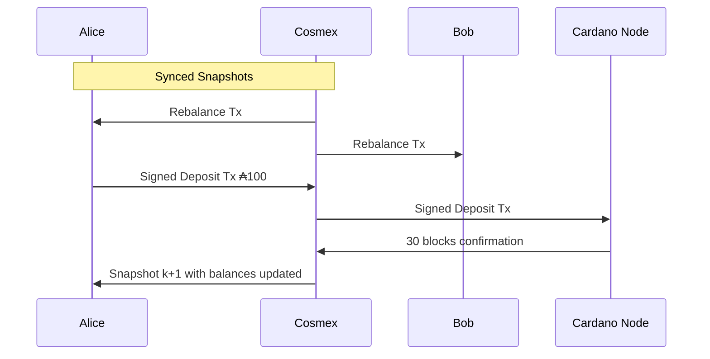

## References

[1] P. Virtanen, C. Bromberg, et al., "The Cardano Blockchain Platform: A Technical Overview," Report, IOHK, 2020.

[2] M. Chakravarty, S. Thompson, R. Kireev, et al., "Hydra: Fast Isomorphic State Channels," Cryptology ePrint Archive, Report 2020/299, 2020. https://eprint.iacr.org/2020/299

[3] J. Poon and T. Dryja, "The Bitcoin Lightning Network: Scalable Off-Chain Instant Payments," White Paper, Version 0.5.9.2, 2016.

[4] V. Buterin, "Ethereum: A Next-Generation Smart Contract and Decentralized Application Platform," White Paper, 2014.

[5] S. Nakamoto, "Bitcoin: A Peer-to-Peer Electronic Cash System," White Paper, 2008.

[6] A. Back, M. Corallo, et al., "Enabling Blockchain Innovations with Pegged Sidechains," Blockstream White Paper, 2014.

[7] L. Gudgeon, P. Moreno-Sanchez, S. Roos, P. McCorry, and A. Gervais, "SoK: Layer-Two Blockchain Protocols," In International Conference on Financial Cryptography and Data Security, Springer, 2020.

[8] P. McCorry, C. Buckland, B. Mannerings, et al., "SoK: Off The Chain Transactions," IACR Cryptol. ePrint Arch., 2019.

[9] A. Miller, I. Bentov, et al., "Sprites and State Channels: Payment Networks that Go Faster than Lightning," In International Conference on Financial Cryptography and Data Security, Springer, 2019.

[10] R. Khalil and A. Gervais, "Revive: Rebalancing Off-Blockchain Payment Networks," In Proceedings of the 2017 ACM SIGSAC Conference on Computer and Communications Security, 2017.

[11] J. Lind, O. Naor, I. Eyal, et al., "Teechain: A Secure Payment Network with Asynchronous Blockchain Access," In Proceedings of the 27th ACM Symposium on Operating Systems Principles, 2019.

[12] C. Decker and R. Wattenhofer, "A Fast and Scalable Payment Network with Bitcoin Duplex Micropayment Channels," In International Symposium on Stabilization, Safety, and Security of Distributed Systems, Springer, 2015.

[13] S. Dziembowski, L. Eckey, S. Faust, and D. Malinowski, "Perun: Virtual Payment Hubs over Cryptocurrencies," In 2019 IEEE Symposium on Security and Privacy (SP), 2019.

[14] D. Robinson, "HTLCs Considered Harmful," In Stanford Blockchain Conference 2019.

[15] A. Zamyatin, M. Al-Bassam, D. Zindros, et al., "SoK: Communication Across Distributed Ledgers," Cryptology ePrint Archive, Report 2019/1128, 2019.